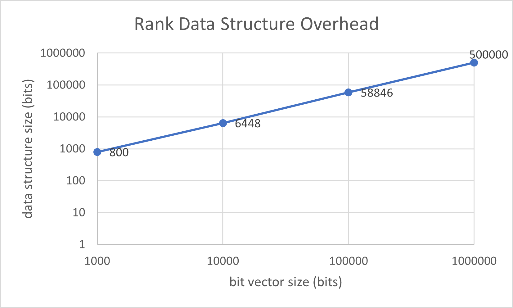
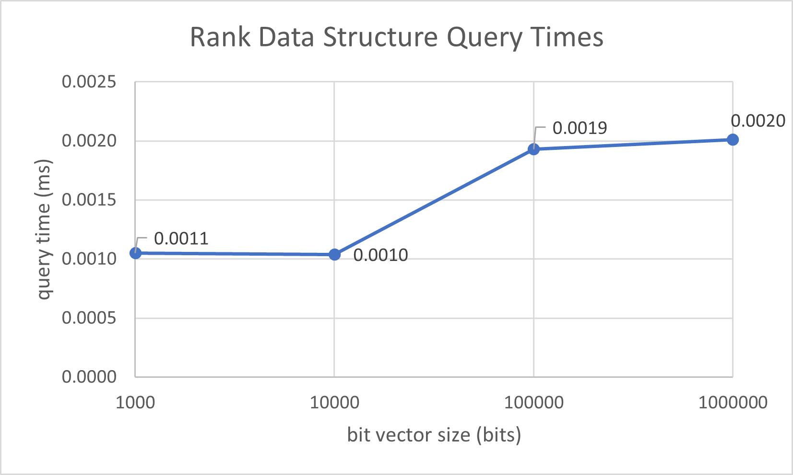
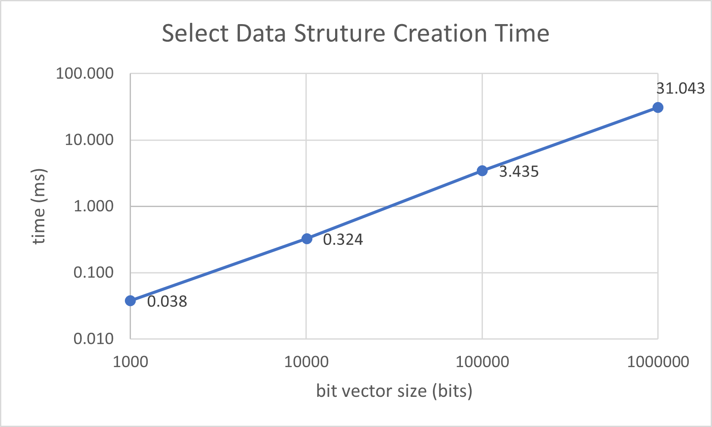
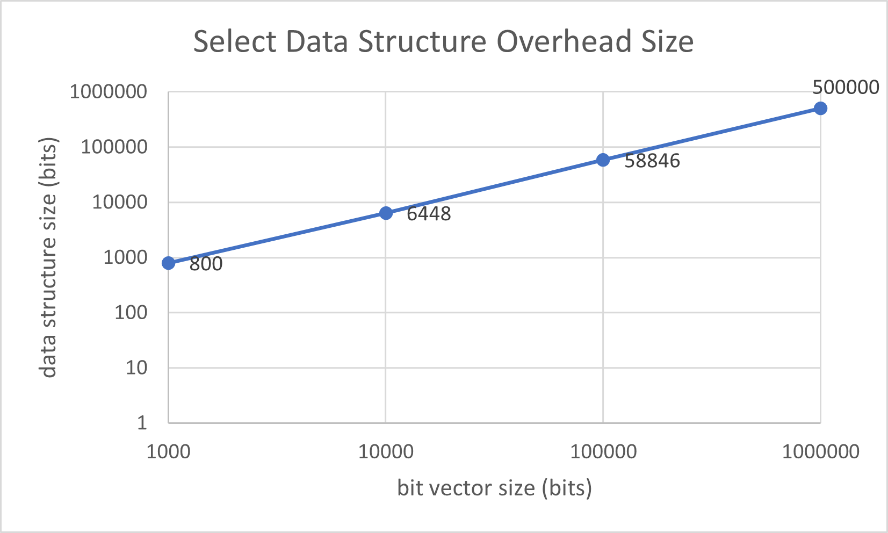
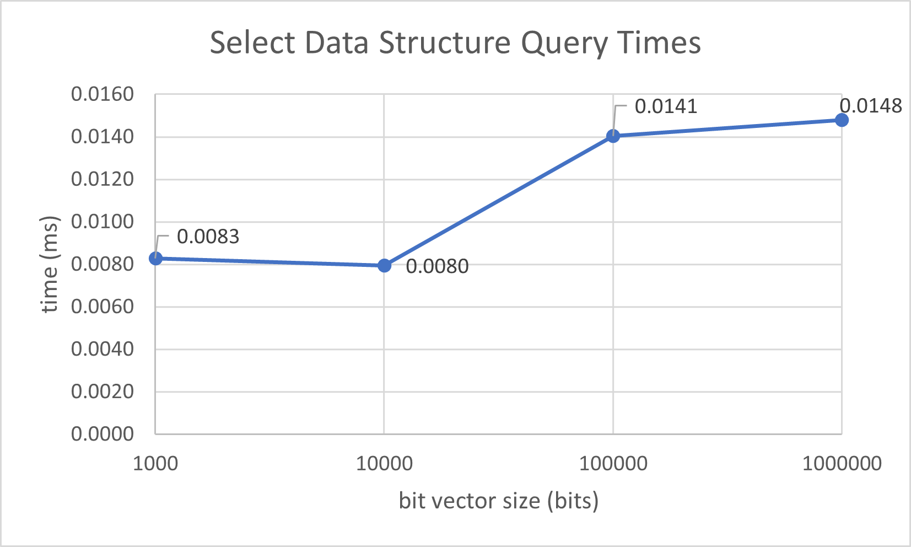
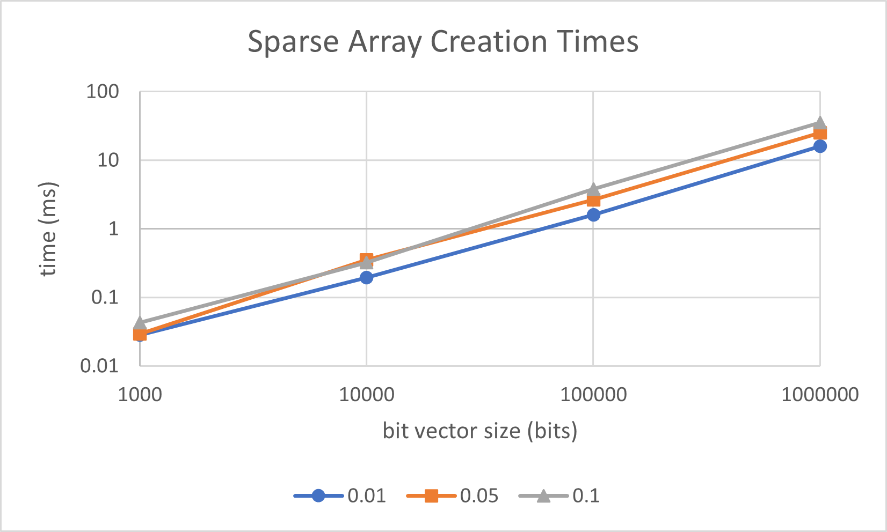
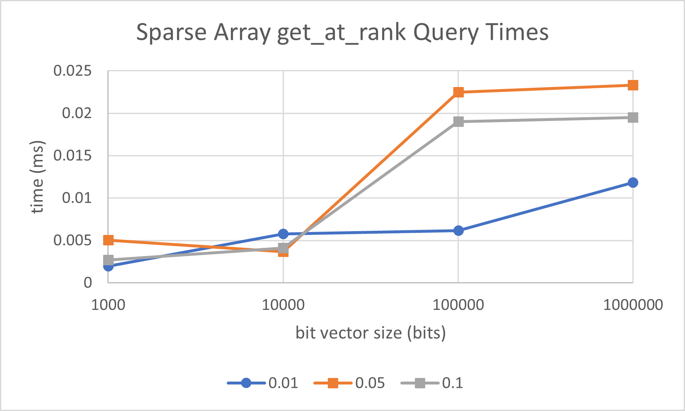
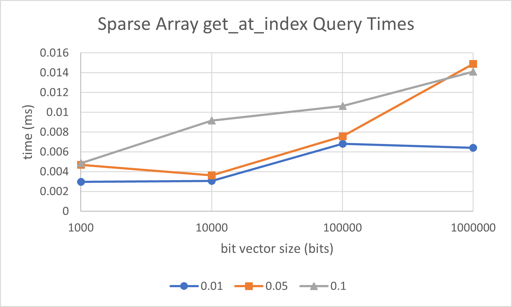
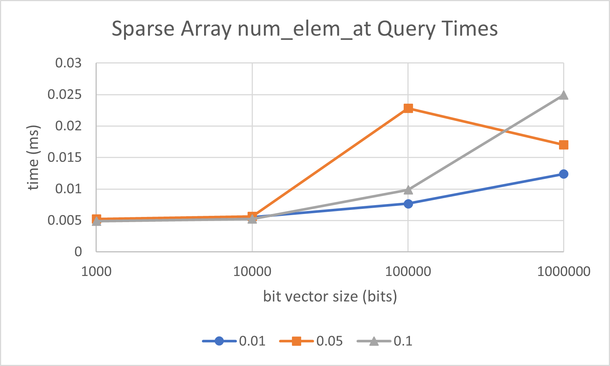

# CMSC 858D Spring 2022 HW 1

MG Hirsch

See instructions here: https://rob-p.github.io/CMSC858D_S22/assignments/01_assignment_01

Github repository: https://github.com/mghirsch42/CMSC858D-Sp22-HW1

## Part 1: Rank

### Description

The rank support data structure stores an int_vector of blocks and an int_vector of superblocks that are populated during a single pass over the data. To calculate rank, it sums the values of the related block and superblock along with the number of extra bits.

### Experiments

Experimental script can be found in `part1/part1.cpp`.

For varying sizes of the bit vector, 1000, 10,000, 100,000, and 1,000,000 bits, I:

1. Timed the creation of the rank support structure
2. Calculated the overhead of the structure
3. Timed calling `rank1` on a random bit 16 times

### Results

Results are averaged over 10 runs.

The above figure shows how long creation for the rank data structure took for each bit vector size. There is an apparent linear relationship between the size of the bit vector and the creation time (note the log scale on both axis). This is consistent with the single pass over the bit vector for creation.

The above figure shows the overhead size of the structure with respect to the bit vector size. There is a linear relationship between the two (note the log scale on both axes). This is consistent between the theoretical $\mathrm{o}(n)$ relationship.

The above figure shows the time taken to perform 16 rank operations for random indices with respect to the bit vector size. There is a near constant relationship, with a jump between 10,000 and 100,000 bits.

### Hardest part

What I found the most difficult part of this task was getting all the index calculations correct. I began trying to implement it exactly as was presented in class and ran across problems when blocks and superblocks did not align. After simplifying the implementation to have the length of the superblocks equal to the square of the length of the blocks, things worked out much easier. Then determining the relevant block and superblock to increment as well as rules for when to copy or keep 0 was straightforward (after staring at it for a while).

## Part 2: Select

### Description

The select support data structure stores a rank support data structure. To answer rank queries, it performs a binary search over the bit vector calculating the ranks of the indices.

### Experiments

Experimental script can be found in `part2.cpp`.

For varying sizes of the bit vector, 1000, 10,000, 100,000, and 1,000,000 bits, I:

1. Timed the creations of the select support structure
2. Calculated the overhead of the structure
3. Timed calling `select1` on a random bit 16 times

### Results

Results are averaged over 10 runs.

The above figure shows the time for creation of the select data structure with respect to the bit vector size. The creation time scales approximately linearly with respect to the bit vector size (note the log scale on both axis). This is consistent with the single pass over the bit vector elements.

The above figure shows the overhead size of the select data structure with respect to the bit vector size. The overhead scales linearly with respect to the bit vector size (note the log scale on both axis). This is consistent with the $\mathrm{o}(n)$ theoretical bound.

The above figure shows the time taken to perform 16 select operations on random indices. It shows a near constant relationship between bit vector size and query time, with a jump between 10,000 and 100,000 bits.

### Hardest part

I found this part very straight forward. The hardest part was probably implementing the binary search, just because it took a few more lines of code.

## Part 3: Sparse Vector

## Description

The SparseVector class stores a bit vector, a related rank support data structure, and a vector of elements. It uses the rank support data structure to answer queries about the elements' locations in the underlying bit vector.

### Experiments

I time the creation and filling of the sparse array.

For each of the methods `get_at_rank`, `get_at_index`, and `num_elem_at`, I timed calling the method 100 times with a random index (indicing the bit vector for `get_at_index` and `num_elem_at` and indicing the elements for `get_at_rank`.)

### Results

All results are averaged over 10 runs.

The above figure plots the sparse array creation times against the bit vector size (both axes in log scale) with different levels of sparsity. The creation time included the creation of the bit vector, filling in the elements, and creating the rank support data structure. At all sparsity levels, there appears to be an approximate linear relationship.

The above figure shows the time taken to run the `get_at_rank` query for a random index 100 times with different sparsity levels with respect to the bit vector size. The higher sparsity levels have a sudden increase in query time when increasing from 1000 to 10,000 bits in the bit vector that is not seen in the lowest sparsity level. 

The figure above shows the time taken to run the `get_at_index` query for a random index 100 times with different sparsity levels with respect to the bit vector size. Generally, the more elements in the array, and the longer the array, the greater the query time. However the precise relationship is not clear from this plot.

The figure above shows the time taken to run the `num_elem_at` query for a random index 100 times with different 
sparsity levels with respect to the bit vector size. Similarly to the previous query, the more elements in the array, and the longer the array, the greater the query time, but the precise relationship is not clear from this plot.

### Size comparison to dense array

The size of this sparse array representation is the space taken up by the bit vector plus the space taken up by the superblocks plus the space taken up by the blocks. Say we want to represent a space array of sie $n$. Then the space taken up by the bit vector is $n$. The space taken up by the blocks is the number of blocks, $\frac{n}{\log_2n}$, times the width of each block, $\log_2(\log_2^2n)$, which equals $n*\frac{\log_2(\log_2^2n)}{\log_2n}$. The space taken up by the superblocks is the number of superblocks, $\frac{n}{\log_2^2n}$, times the width of each superblock, $\log_2n$, which equals $n*\frac{1}{\log_2n}$. Summing these gives $n + n*\frac{\log_2(\log_2^2n)}{\log_2n} + n*\frac{1}{\log_2n}$ or $n*(1+\frac{\log_2(\log_2^2n)}{\log_2n}+\frac{1}{\log_2n})$. As we add elements to the sparse array, we add the number of bits of each element, but the size of the underlying structure does not change. Thus the size of the structure minus the size of the elements themselves is constant with respect to sparsity.

Consider now if each empty element was stored as an empty string instead of using the bit vector. Each empty element would take 8 bits. So the size of the empty dense vector would be $8n$. However, every time we added an element, the size would increase by the number of bits needed to store that element and decrease by the number of bits needed to store the empty element. So in this case, the size of the structure depends on sparsity. If the array has sparsity $s$ (where $0<s\leq1$), then the size of the dense array (minus the size of the elements) would be $8n-8ns = 8n*(1-s)$. 

We can calculate the space savings of the sparse array as the difference of these two values:

$8n*(1-s)-n*(1+\frac{\log_2(\log_2^2n)}{\log_2n}+\frac{1}{\log_2n})$

The number of bits saved with a 1% sparsity and an array size of 1000 is approximately 5424 bits. The number of bits saved with .1% sparsity and an array size of 1,000,000 is approximately 6,516,000 million bits. 

To find when the dense array would be preferred to the sparse array, we can find where it's space would be less: 

$8n*(1-s)<n*(1+\frac{\log_2(\log_2^2n)}{\log_2n}+\frac{1}{\log_2n})$

$s>1-\frac{1}{8}(1+\frac{\log_2(\log_2^2n)}{\log_2n}+\frac{1}{\log_2n})$

For an array of length 1000, the sparsity would need to be at least about 79.5% (79.5% of the elements filled in) for the dense representation to take less space. Similarly, for an array of length 1,000,00, the sparsity would need to be at least approximately 81.5%. 

### Hardest part

The hardest part of this part was deciding where to build the rank support data structure. At first I considered adding it at te end of the eppend method or at the beginning of the method calls that used it, but instead I decided to make it it's own method and make the user call it. That way it's only being built as often as it needs to be.